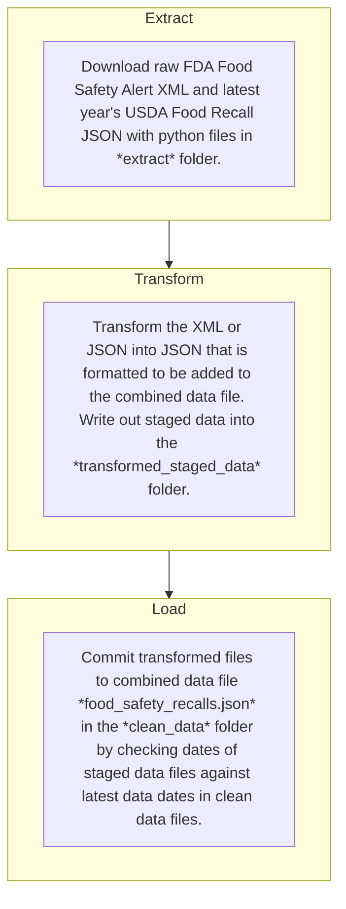

# Food Safety Recalls

This project collects, organizes, and republishes data from food safety recalls issued by the US [Food and Drug Administration](https://www.fda.gov/) (FDA) and the US Department of Agriculture's (USDA) [Food Safety and Inspection Service (FSIS)](https://www.fsis.usda.gov/). Food recalls are the — typically voluntary — removal of a food product from the market that is in violation of [FDA](https://www.fda.gov/food/guidance-regulation-food-and-dietary-supplements) or [USDA](https://www.fsis.usda.gov/policy) food safety regulations by the producing or manufactoring company. Food safety violations can include mislabeled foods, contamination with disease causing microorganisms, or the presence of dangerous foreign objects, among others. Recalls involving meat, poultry, and eggs are managed by the USDA while recalls involving all other food products are managed by the FDA. More information on food recalls can be found [here](https://www.fda.gov/food/buy-store-serve-safe-food/food-recalls-what-you-need-know) and [here](https://www.fsis.usda.gov/food-safety/safe-food-handling-and-preparation/food-safety-basics/understanding-fsis-food-recalls). 

The latest data can be found in the `food_safety_recalls.json` file in the `clean_data` folder in this repository. This data includes the recall title, date, recalled products, issuing company, and impacted states, along with additional descriptive information. Each node in the JSON file is an indivdual recall issued by the FDA or USDA. Full documentation of the data can be found in the [data dictionary](#data-dictionary). An example of two nodes in the JSON data can be found in the [data preview example](#data-preview-example). A summary of how new data is updated can be found in the [data update pipeline](#data-update-pipeline).

## Data Details

### FDA Data

Food safety recall data from the FDA is from the [Recalls, Market Withdrawals, & Safety Alerts](https://www.fda.gov/safety/recalls-market-withdrawals-safety-alerts) page. Note that FDA data posted on this page and included in the final data in this repository can include product market withdrawals and safety alerts in addition to recalls but are referred to generally in this project as "recalls". Many of the recalls posted on the FDA's [Recalls, Market Withdrawals, & Safety Alerts](https://www.fda.gov/safety/recalls-market-withdrawals-safety-alerts) page are public warnings which according to the FDA are for urgent situations meant to alert the public that a product being recalled presents a serious hazard to health, and where other means for preventing the use of a recalled product appear inadequate. The FDA typically issues public warnings in [Class I or potential Class I recalls](https://www.fda.gov/safety/industry-guidance-recalls/recalls-background-and-definitions) as well as some urgent Class II recalls that still present a serious hazard to health. That said, not every food safety recall posted on the [Recalls, Market Withdrawals, & Safety Alerts](https://www.fda.gov/safety/recalls-market-withdrawals-safety-alerts) page is necessarily a public warning. The FDA posts removal or correction information that has been publicized by a company as a public service. The existance of any given recall posted on the page does not necessarily mean that the situation is urgent or that the product presents a serious hazard to health. More information on the FDA public warning notification can be found in [regulatory guidance document](https://www.fda.gov/media/110457/download) [21 CFR Part 7, Subpart C](https://www.fda.gov/regulatory-information/search-fda-guidance-documents/public-warning-notification-recalls-under-21-cfr-part-7-subpart-c).

The FDA posts food safety recalls on the [Recalls, Market Withdrawals, & Safety Alerts](https://www.fda.gov/safety/recalls-market-withdrawals-safety-alerts) as it receives them from private companies or other public health agencies. Typically this notification occurs some time before a food safety recall might be officially classified (e.g. Class I, II, or III) by the FDA and thus included in the administration's [enforcement reports](https://www.fda.gov/safety/recalls-market-withdrawals-safety-alerts/enforcement-reports). Because of this and the fact that the resource includes market withdrawals and safety alerts, in my opinion information from the [Recalls, Market Withdrawals, & Safety Alerts](https://www.fda.gov/safety/recalls-market-withdrawals-safety-alerts) page include more timely data of the most current food safety threats.

It is important to note that food safety recalls posted on the [Recalls, Market Withdrawals, & Safety Alerts](https://www.fda.gov/safety/recalls-market-withdrawals-safety-alerts) page do ***not*** include [all food safety recalls issued](https://datadashboard.fda.gov/ora/cd/recalls.htm) by the FDA. A more complete accounting can be found in the administration's [enforcement reports](https://www.fda.gov/safety/recalls-market-withdrawals-safety-alerts/enforcement-reports). Not every food safety recall administered by the FDA has a dedicated press release as the process of posting of information on the [Recalls, Market Withdrawals, & Safety Alerts](https://www.fda.gov/safety/recalls-market-withdrawals-safety-alerts) page is separate from the FDA's recall classification process. More information on this distiction can be found [here](https://www.fda.gov/regulatory-information/search-fda-guidance-documents/public-warning-notification-recalls-under-21-cfr-part-7-subpart-c).

### USDA Data

Data from the USDA's FSIS include _all_ official [food safety recalls](https://www.fsis.usda.gov/recalls) (Classes I - III) and [public health alerts](https://www.fsis.usda.gov/taxonomy/term/555) concerning meat, poultry and egg products. A FSIS food safety _recall_ is a typically voluntary action by a company to remove adulterated or misbranded meat, poultry, or egg product from commerce. The FSIS issues public health alerts to inform the public about potential health risks in cases where a food safety recall cannot at the time be recommended. These often include foodborne illness outbreaks that do not yet have an identified food origin source. These recalls include ones with news releases — typically Class I and II recalls — as well as Class III recalls and public health alerts. These recalls can come about through a product of a company notification similar to many of the instances in the FDA data but also through FSIS food safety investigations as well as information provided by public health partners like state or local public health departments or agencies like the FDA or the [Centers for Disease Control and Prevention (CDC)](https://www.cdc.gov).

More information about the USDA's FSIS food safety recalls can be found [here](https://www.fsis.usda.gov/food-safety/safe-food-handling-and-preparation/food-safety-basics/understanding-fsis-food-recalls).

## Data Sources

This repository leverages two sources for food recall data:
1. The FDA [Food Safety Recall RSS feed](https://www.fda.gov/about-fda/contact-fda/stay-informed/rss-feeds/food-safety-recalls/rss.xml) which publishes the titles, dates, and permanent URLs for [Recalls, Market Withdrawals, & Safety Alerts](https://www.fda.gov/safety/recalls-market-withdrawals-safety-alerts) published by the FDA. 
2. The USDA [FSIS Recall API](https://www.fsis.usda.gov/science-data/developer-resources/recall-api) which contains detailed information of every food safety recall and public health alert for meat, poultry, and egg products which fall under the USDA FSIS purview. More documentation of the USDA FSIS Recall API can be found [here](https://www.fsis.usda.gov/sites/default/files/media_file/documents/Recall-API-documentation.pdf).

## Data Update Pipeline

This repository updates data with new recalls as they are issued with the following extract, transform, and load (ETL) pipeline: 


This pipeline is automated through GitHub Actions specified in YAML files in the `.github/workflows` folder.

## Data Dictionary

| **Variable Name**     | **Variable Data Type** | **Variable Description**                                                                                                                                                                                                                                                                                                                                                                                                                                                                            |
|-----------------------|------------------------|-----------------------------------------------------------------------------------------------------------------------------------------------------------------------------------------------------------------------------------------------------------------------------------------------------------------------------------------------------------------------------------------------------------------------------------------------------------------------------------------------------|
| title                 | str                    | The provided title of the recall notice.                                                                                                                                                                                                                                                                                                                                                                                                                                                            |
| company_announce_dttm | utc datetime           | A UTC datetime of when company involved in recall announced recall to the public. _This value exists only for data from the FDA_.                                                                                                                                                                                                                                                                                                                                                                   |
| notification_dttm     | utc datetime           | A UTC datetime of when recall was posted by regulatory agency.                                                                                                                                                                                                                                                                                                                                                                                                                                      |
| recall_reason         | str                    | A short description of what food safety related health risk to consumers prompted the recall notification.                                                                                                                                                                                                                                                                                                                                                                                          |
| company_name          | str                    | The name of company involved in manufacturing recalled product. Typically recall notification is issued by this company in accordance with regulator.                                                                                                                                                                                                                                                                                                                                               |
| brand_name            | str                    | The brand name of product(s) involved in recall. _This value exists only for data from the FDA_.                                                                                                                                                                                                                                                                                                                                                                                                                                                   |
| product_description   | str                    | A short description of the food products involved in recall.                                                                                                                                                                                                                                                                                                                                                                                                                                        |
| impacted_states       | list                   | A list of US state/overseas territory postal codes of states that are impacted by the recall because recalled product had known distribution to it. For recalls from the USDA these are provided by the agency but for recalls from the FDA they are matched via regular expression search for state names or abbreviations mentioned in the recall notice text. FDA recalls with the text `nationwide` or `US` include match for `US` and implied distribution across the United States.                                                                                                                                                      |
| agency                | str                    | Agency that issued the recall. Currently only `FDA` or `USDA`                                                                                                                                                                                                                                                                                                                                                                                                                                       |
| uid                   | uid                    | Unique identifier for recall. This is a random [version four UUID](https://en.wikipedia.org/wiki/Universally_unique_identifier) generated at data extraction.                                                                                                                                                                                                                                                                                                                                       |
| recall_url            | str                    | An HTTP URL that is associated with each recall notification. These are permalinks that are extracted from the RSS feeds for each agency's food safety alerts.                                                                                                                                                                                                                                                                                                                                      |
| notice_id_number      | str                    | The recall ID number. For recalls this is typically in NNN-YYYY format where YYYY is the four digit calendar year the recall was issued and N is the Nth number recall in that given calendar year. Public health alert IDs start with "PHA" and follow this format: PHA-MMDDYYYY-NN where MMDDYYYY is the two-digit month, two-digit day, and four-digit year the alert was issued and NN is the Nth number of alert that was issued on that day. _This value exists only for data from the USDA._ |
| recall_type           | str                    | The type of recall announced. This will be one of `Outbreak`, `Public Health Alert`, `Active Recall`, or `Closed Recall`. _This value exists only for data from the USDA_.                                                                                                                                                                                                                                                                                                                          |
| risk_level            | str                    | The recall risk level. This will be one of `High - Class I`, `Medium - Class I`, `Low - Class II`, `Marginal - Class III`,  or `Public Health Alert`. _This value exists only for data from the USDA_.                                                                                                                                                                                                                                                                                              |
| recall_classification | str                    | The recall classification level. This will be one of `Class I`, `Class II`, `Class III`, or `Public Health Alert`. _This value exists only for data from the USDA_.                                                                                                                                                                                                                                                                                                                                 |

## Data Preview Example

```
    {
        "title": "Yu Shang Food Inc. Recalls Ready-to-Eat Meat and Poultry Products Due to Possible Listeria Contamination",
        "company_announce_dttm": [],
        "notification_dttm": "2024-11-09T05:00:00+00:00",
        "recall_reason": "Product Contamination",
        "company_name": "Yushang Food Inc.",
        "brand_name": [],
        "product_description": [],
        "impacted_states": [],
        "agency": "USDA",
        "uid": "21fdf47d-d010-43b8-a7f4-d0a895586ecb",
        "recall_url": "http://www.fsis.usda.gov/recalls-alerts/yu-shang-food-inc--recalls-ready-eat-meat-and-poultry-products-due-possible-listeria",
        "notice_id_number": "030-2024",
        "recall_type": "Active Recall",
        "risk_level": "High - Class I",
        "recall_classification": "Class I"
    },
    {
        "title": "Gilster - Mary Lee Corp. Issues a Recall for Undeclared Egg Allergen in Bowl & Basket Onion Soup Mix",
        "company_announce_dttm": "2024-11-12T05:00:00+00:00",
        "notification_dttm": "2024-11-13T00:26:00+00:00",
        "recall_reason": "Undeclared egg",
        "company_name": "Gilster Mary Lee Corporation",
        "brand_name": "Bowl & Basket",
        "product_description": "Onion Soup Mix",
        "impacted_states": [
            "NJ",
            "MO"
        ],
        "agency": "FDA",
        "uid": "e55aa881-2f0a-4636-b6bc-a18848e72f89",
        "recall_url": "http://www.fda.gov/safety/recalls-market-withdrawals-safety-alerts/gilster-mary-lee-corp-issues-recall-undeclared-egg-allergen-bowl-basket-onion-soup-mix",
        "notice_id_number": [],
        "recall_type": [],
        "risk_level": [],
        "recall_classification": []
    }
```

Note that fields with string and datetime data values that are missing data will contain `null` values while fields with list data values that are missing data will contain an empty list `[]`.