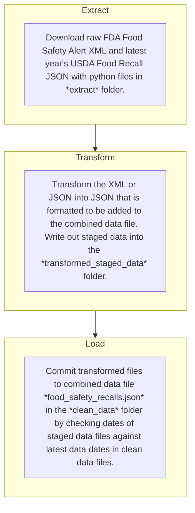

# Food Safety Recalls 

This repository contains a JSON file in `./clean_data/food_safety_recalls.json` of food safety recall data gathered from the US [Food and Drug Administration](https://www.fda.gov/safety/recalls-market-withdrawals-safety-alerts) (FDA) and the [US Department of Agriculture's](https://www.fsis.usda.gov/recalls) (USDA) Food Safety and Inspection Service (FSIS). This data includes the recall title, date, recalled products, issuing company, and impacted states, along with additional descriptive information. This repository updates data with new recalls as they are issued with the following extract, transform, and load (ETL) pipeline:



This pipeline is automated through GitHub Actions specified in YAML files in the `.github/workflows` folder.

## Data Dictionary

| **Variable Name**     | **Variable Data Type** | **Variable Description**                                                                                                                                                                                                                                                                                                                                                                                                                                                                            |
|-----------------------|------------------------|-----------------------------------------------------------------------------------------------------------------------------------------------------------------------------------------------------------------------------------------------------------------------------------------------------------------------------------------------------------------------------------------------------------------------------------------------------------------------------------------------------|
| title                 | str                    | The provided title of the recall notice.                                                                                                                                                                                                                                                                                                                                                                                                                                                            |
| company_announce_dttm | utc datetime           | A UTC datetime of when company involved in recall announced recall to the public. _This value exists only for data from the FDA_.                                                                                                                                                                                                                                                                                                                                                                   |
| notification_dttm     | utc datetime           | A UTC datetime of when recall was posted by regulatory agency.                                                                                                                                                                                                                                                                                                                                                                                                                                      |
| recall_reason         | str                    | A short description of what food safety related health risk to consumers prompted the recall notification.                                                                                                                                                                                                                                                                                                                                                                                          |
| company_name          | str                    | The name of company involved in manufacturing recalled product. Typically recall notification is issued by this company in accordance with regulator.                                                                                                                                                                                                                                                                                                                                               |
| brand_name            | str                    | The brand name of product(s) involved in recall. _This value exists only for data from the FDA_.                                                                                                                                                                                                                                                                                                                                                                                                                                                   |
| product_description   | str                    | A short description of the food products involved in recall.                                                                                                                                                                                                                                                                                                                                                                                                                                        |
| impacted_states       | list                   | A list of US state/overseas territory postal codes of states that are impacted by the recall because recalled product had known distribution to it. For recalls from the USDA these are provided by the agency but for recalls from the FDA they are matched via regular expression search for state names or abbreviations mentioned in the recall notice text. FDA recalls with the text `nationwide` or `US` include match for `US` and implied distribution across the United States.                                                                                                                                                      |
| agency                | str                    | Agency that issued the recall. Currently only `FDA` or `USDA`                                                                                                                                                                                                                                                                                                                                                                                                                                       |
| uid                   | uid                    | Unique identifier for recall. This is a random [version four UUID](https://en.wikipedia.org/wiki/Universally_unique_identifier) generated at data extraction.                                                                                                                                                                                                                                                                                                                                       |
| recall_url            | str                    | An HTTP URL that is associated with each recall notification. These are permalinks that are extracted from the RSS feeds for each agency's food safety alerts.                                                                                                                                                                                                                                                                                                                                      |
| notice_id_number      | str                    | The recall ID number. For recalls this is typically in NNN-YYYY format where YYYY is the four digit calendar year the recall was issued and N is the Nth number recall in that given calendar year. Public health alert IDs start with "PHA" and follow this format: PHA-MMDDYYYY-NN where MMDDYYYY is the two-digit month, two-digit day, and four-digit year the alert was issued and NN is the Nth number of alert that was issued on that day. _This value exists only for data from the USDA._ |
| recall_type           | str                    | The type of recall announced. This will be one of `Outbreak`, `Public Health Alert`, `Active Recall`, or `Closed Recall`. _This value exists only for data from the USDA_.                                                                                                                                                                                                                                                                                                                          |
| risk_level            | str                    | The recall risk level. This will be one of `High - Class I`, `Medium - Class I`, `Low - Class II`, `Marginal - Class III`,  or `Public Health Alert`. _This value exists only for data from the USDA_.                                                                                                                                                                                                                                                                                              |
| recall_classification | str                    | The recall classification level. This will be one of `Class I`, `Class II`, `Class III`, or `Public Health Alert`. _This value exists only for data from the USDA_.                                                                                                                                                                                                                                                                                                                                 |


## Data Preview Example

```
    {
        "title": "Yu Shang Food Inc. Recalls Ready-to-Eat Meat and Poultry Products Due to Possible Listeria Contamination",
        "company_announce_dttm": [],
        "notification_dttm": "2024-11-09T05:00:00+00:00",
        "recall_reason": "Product Contamination",
        "company_name": "Yushang Food Inc.",
        "brand_name": [],
        "product_description": [],
        "impacted_states": [],
        "agency": "USDA",
        "uid": "21fdf47d-d010-43b8-a7f4-d0a895586ecb",
        "recall_url": "http://www.fsis.usda.gov/recalls-alerts/yu-shang-food-inc--recalls-ready-eat-meat-and-poultry-products-due-possible-listeria",
        "notice_id_number": "030-2024",
        "recall_type": "Active Recall",
        "risk_level": "High - Class I",
        "recall_classification": "Class I"
    },
    {
        "title": "Gilster - Mary Lee Corp. Issues a Recall for Undeclared Egg Allergen in Bowl & Basket Onion Soup Mix",
        "company_announce_dttm": "2024-11-12T05:00:00+00:00",
        "notification_dttm": "2024-11-13T00:26:00+00:00",
        "recall_reason": "Undeclared egg",
        "company_name": "Gilster Mary Lee Corporation",
        "brand_name": "Bowl & Basket",
        "product_description": "Onion Soup Mix",
        "impacted_states": [
            "NJ",
            "MO"
        ],
        "agency": "FDA",
        "uid": "e55aa881-2f0a-4636-b6bc-a18848e72f89",
        "recall_url": "http://www.fda.gov/safety/recalls-market-withdrawals-safety-alerts/gilster-mary-lee-corp-issues-recall-undeclared-egg-allergen-bowl-basket-onion-soup-mix",
        "notice_id_number": [],
        "recall_type": [],
        "risk_level": [],
        "recall_classification": []
    }
```

Note that fields with missing data will contain an empty list `[]`.

## Data Sources
This repository leverages two sources for food recall data:
1. The FDA [Food Safety Recall RSS feed](https://www.fda.gov/about-fda/contact-fda/stay-informed/rss-feeds/food-safety-recalls/rss.xml) which publishes the titles, dates, and URLs for food safety recalls announced jointly by the FDA and private industry. Notably this feed does not contain all FDA recalls nor every food safety recall the FDA issues. It also contains no information about recall risk level and classification. Additional information can be found [here](https://www.fda.gov/safety/recalls-market-withdrawals-safety-alerts/additional-information-about-recalls).
2. The USDA [FSIS Recall API](https://www.fsis.usda.gov/science-data/developer-resources/recall-api) which contains detailed information of every food safety recall and alert for meat, poultry, and egg products which fall under the USDA FSIS purview. More documentation of the USDA FSIS Recall API can be found [here](https://www.fsis.usda.gov/sites/default/files/media_file/documents/Recall-API-documentation.pdf).
