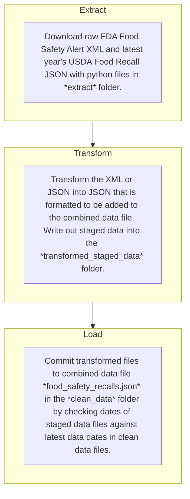

# Food Safety Recalls 

This repository contains a JSON file in `./clean_data/food_safety_recalls.json` of food safety recall data gathered from the US [Food and Drug Administration](https://www.fda.gov/safety/recalls-market-withdrawals-safety-alerts) (FDA) and the [US Department of Agriculture's](https://www.fsis.usda.gov/recalls) (USDA) Food Safety and Inspection Service (FSIS). This data includes the recall title, date, recalled products, issuing company, and impacted states, along with additional descriptive information. This repository updates data with new recalls as they are issued with the following extract, transform, and load (ETL) pipeline:

This pipeline is automated through GitHub Actions specified in YAML files in the `.github/workflows` folder.

## Data Sources
This repository leverages two sources for food recall data:
1. The FDA [Food Safety Recall RSS feed](https://www.fda.gov/about-fda/contact-fda/stay-informed/rss-feeds/food-safety-recalls/rss.xml) which publishes the titles, dates, and URLs for food safety recalls announced jointly by the FDA and private industry. Notably this feed does not contain all FDA recalls nor every food safety recall the FDA issues. It also contains no information about recall risk level and classification. Additional information can be found [here](https://www.fda.gov/safety/recalls-market-withdrawals-safety-alerts/additional-information-about-recalls).
2. The USDA [FSIS Recall API](https://www.fsis.usda.gov/science-data/developer-resources/recall-api) which contains detailed information of every food safety recall and alert for meat, poultry, and egg products which fall under the USDA FSIS purview.
